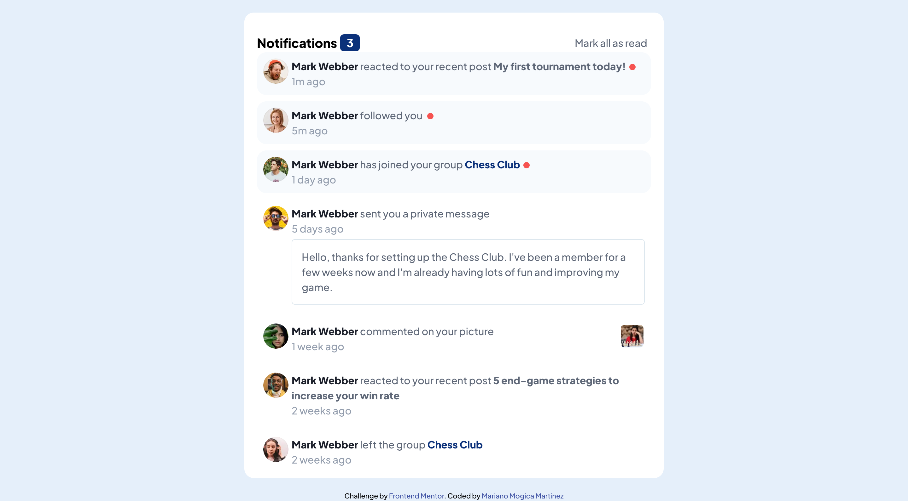
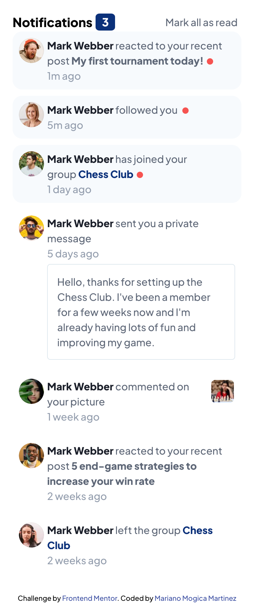

# Frontend Mentor - Notifications page solution

This is a solution to the [Notifications page challenge on Frontend Mentor](https://www.frontendmentor.io/challenges/notifications-page-DqK5QAmKbC). Frontend Mentor challenges help you improve your coding skills by building realistic projects.

## Table of contents

- [Overview](#overview)
  - [The challenge](#the-challenge)
  - [Screenshot](#screenshot)
  - [Links](#links)
- [My process](#my-process)
  - [Built with](#built-with)
  - [What I learned](#what-i-learned)
  - [Continued development](#continued-development)
  - [Useful resources](#useful-resources)
- [Author](#author)

## Overview

### The challenge

Users should be able to:

- Distinguish between "unread" and "read" notifications
- Select "Mark all as read" to toggle the visual state of the unread notifications and set the number of unread messages to zero
- View the optimal layout for the interface depending on their device's screen size
- See hover and focus states for all interactive elements on the page

### Screenshot




### Links

- Solution URL: [GitHub Repository](https://github.com/Mariano7M/fm-notifications-page)
- Live Site URL: [GitHub page](https://mariano7m.github.io/fm-notifications-page/)

## My process

In order to complete this challenge I started creating the project by using Vite + react. Once I finished the project setup I started with the structure of the content in Html. After that I decided to export some of the elements in external components to keep everything more simple. With every component I was adding the style. I think having the elements on its own component lets the work to be more easy since you are only worried on the main goal of each component. I use the useState from react to keep track of the notifications and its properties.

### Built with

- Semantic HTML5 markup
- CSS custom properties
- Flexbox
- Mobile-first workflow
- [React](https://reactjs.org/) - JS library

### What I learned

I think one of the most important things I learned was how to use the useState from react because I used to track the isRead property of each notification.

To see how you can add code snippets, see below:

```js
const [notifications, setNotifications] = useState(initialNotifications)
const newNotificationsCount = notifications.filter(
	notification => !notification.isRead
).length

function handleMarkAsRead() {
	setNotifications(currentState => {
		return currentState.map(notification => {
			if (!notification.isRead) {
				return {
					...notification,
					isRead: true,
				}
			}
			return notification
		})
	})
}
```

### Continued development

I think this challenge really help with my learing on React but I still think I need to learn in more details other features of this React Framework like routing, state managament and probably more things.

### Useful resources

- [React - Quick Start](https://react.dev/learn) - This is an amazing article which helped me finally understand how the components in React actually works.
- [React - Importing and Exporting Components](https://react.dev/learn/importing-and-exporting-components) - This helped me on how to import react on existing project. I used vite to initialice with just vanilla JS so I added react plugin later.
- [Vite - Getting Started](https://vitejs.dev/guide/) - This is an amazing article which helped me understand how to create an enviroment for Javascript project.

## Author

- Frontend Mentor - [@Mariano7M](https://www.frontendmentor.io/profile/Mariano7M)
- Twitter - [@10MARINHO](https://twitter.com/10MARINHO)
